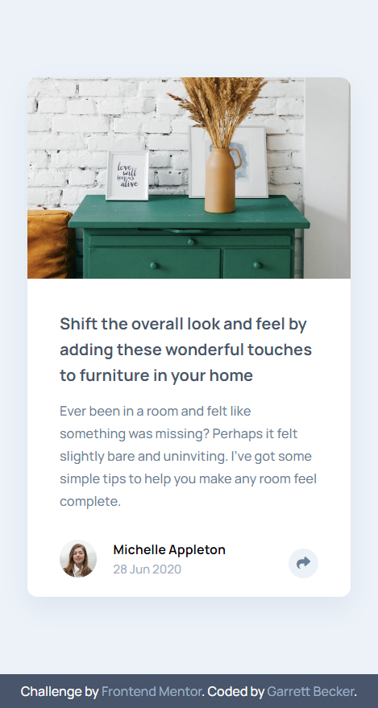
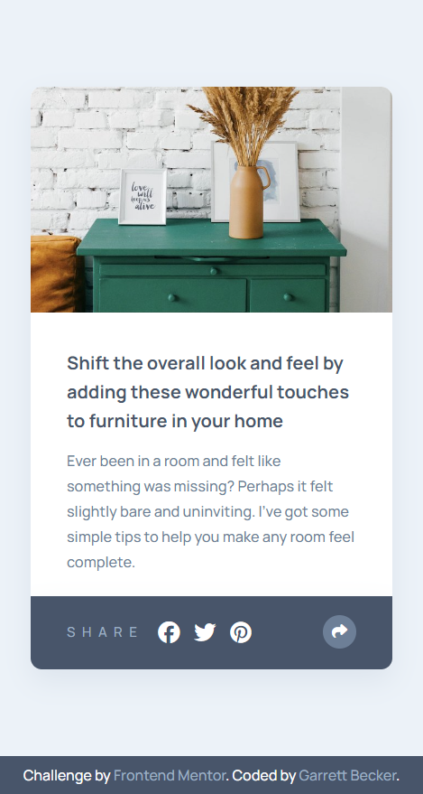
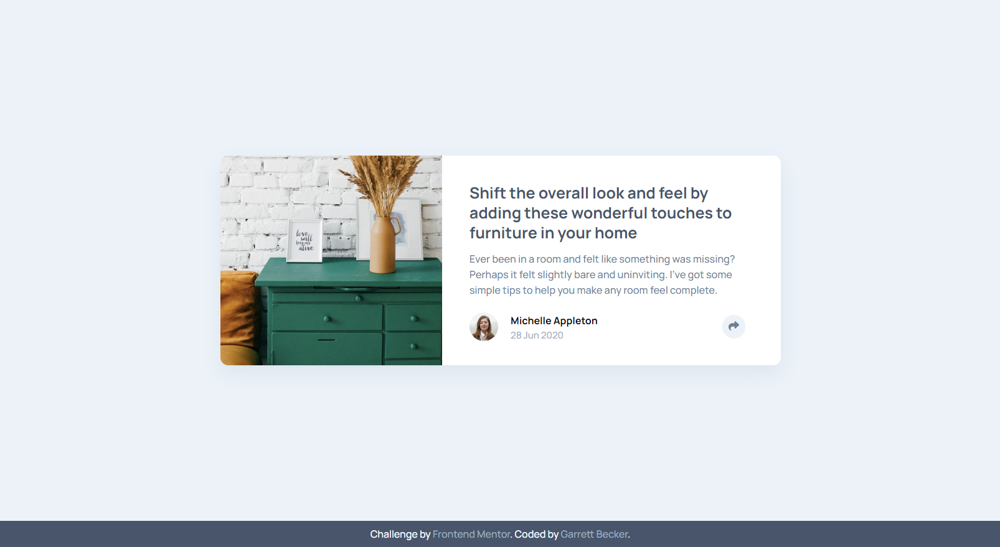
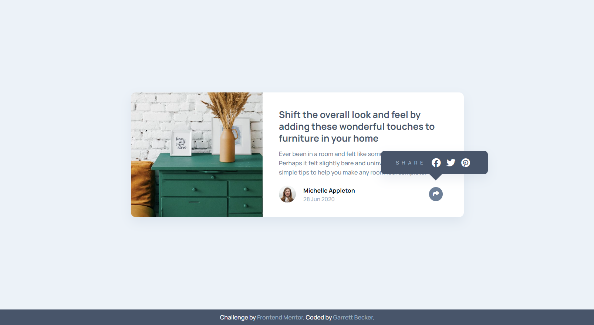

# Frontend Mentor - Article Preview Component Solution

This is my solution to the [Article preview component challenge on Frontend Mentor](https://www.frontendmentor.io/challenges/article-preview-component-dYBN_pYFT). I'm super thankful to have found Frontend Mentor as a great way to confidently grow in my coding skills with real-life projects. 

## Table of contents

- [Frontend Mentor - Article Preview Component Solution](#frontend-mentor---article-preview-component-solution)
	- [Table of contents](#table-of-contents)
	- [Overview](#overview)
		- [Project Brief](#project-brief)
		- [Mobile View](#mobile-view)
		- [Mobile View with Links Menu](#mobile-view-with-links-menu)
		- [Desktop View](#desktop-view)
		- [Desktop View with Links Menu](#desktop-view-with-links-menu)
		- [Links](#links)
	- [My process](#my-process)
		- [Built with](#built-with)
		- [What I learned](#what-i-learned)
		- [Continued development](#continued-development)
		- [Useful resources](#useful-resources)
	- [Author](#author)
	- [Acknowledgments](#acknowledgments)

## Overview

### [Project Brief](./project%20brief/)

Your challenge is to build out this article preview component and get it looking as close to the design as possible.

You can use any tools you like to help you complete the challenge. So if you've got something you'd like to practice, feel free to give it a go.

The only JavaScript you'll need for this challenge is to initiate the share options when someone clicks the share icon.

Your users should be able to: 

- View the optimal layout for the component depending on their device's screen size
- See the social media share links when they click the share icon

Want some support on the challenge? [Join our community](https://www.frontendmentor.io/community) and ask questions in the **#help** channel.

### Mobile View



### Mobile View with Links Menu



### Desktop View



### Desktop View with Links Menu



### Links

- [Solution URL]()
- [Live Site URL](https://article-preview-component-gdbecker.netlify.app)

## My process

### Built with

- HTML5
- CSS3
- JavaScript
- Mobile-first workflow
- [VS Code](https://code.visualstudio.com)

### What I learned

I was not expecting my CSS file to be as long as it is but I greatly appreciated all the little challenges with this project and getting to use semantic HTML and CSS to build. There was the shelves image that needed some specific positioning and size adjustments, the article author row, and especially the button to open up the social links menu. I first tackled the desktop version since I knew I needed some z-indexing and absolute positioning for that links menu, and I used an 'after' pseudo selector for the triangle and positioned that with absolute as well. It wasn't too bad moving into the mobile version and there I added a z-index for the main card button to appear over the links menu when clicked. All said finishing this component took a bit longer than expected but this was great practice, and I definitely want to keep building more projects with the basic tools like in this one. 

Here are a few code samples from this project:

```html
<!-- Card bottom section -->
<div class="second">
	<h1>
		Shift the overall look and feel by adding these wonderful touches to furniture in your home
	</h1>
	<p>
		Ever been in a room and felt like something was missing? Perhaps it felt slightly bare and uninviting. I’ve got some simple tips to help you make any room feel complete.
	</p>
	<div class="row">
		<div class="author">
			
			<div class="author-details">
				<h3>Michelle Appleton</h3>
				<p>28 Jun 2020</p>
			</div>
		</div>
		<button class="btn-card">
			<i class="fa-solid fa-share"></i>
		</button>
	</div>
</div>
```

```css
/* Styles for the card bottom */
.second {
	width: 425px;
	display: flex;
	flex-direction: column;
	justify-content: space-between;
	align-items: flex-start;
	padding: 2.2rem;
}

.second img {
	width: 37px;
	height: 37px;
	border-radius: 50%;
	margin-right: 1rem;
}

.row {
	display: flex;
	flex-direction: row;
	justify-content: space-between;
	align-items: center;
	width: 100%;
	margin: 0;
	margin-top: 1rem;
}

.author {
	margin: 0;
	display: flex;
	flex-direction: row;
	justify-content: flex-start;
	align-items: center;
}

.author-details {
	margin: 0;
	margin-top: 0.25rem;
	display: flex;
	flex-direction: column;
}
```

### Continued development

As a starter developer, I want to keep growing in working as a team and learning how to deliver smaller packages of code at a time, such as components like this one. I thought this project was a good way to get back into React and begin doing just that!

### Useful resources

- [CSS Formatter](http://www.lonniebest.com/FormatCSS/) - I found this helpful site when I'm feeling lazy and don't want to format my CSS code, I can have this do it for me, especially putting everything in alphabetical order.
- Brad Traversy's [50 Projects In 50 Days - HTML, CSS & JavaScript course on Udemy](https://www.udemy.com/course/50-projects-50-days/) - I highly recommend this course for great practice in using just HTML, CSS, and vanilla JavaScript to build amazing projects.

## Author

- Website - [Garrett Becker]()
- Frontend Mentor - [@gdbecker](https://www.frontendmentor.io/profile/gdbecker)
- LinkedIn - [Garrett Becker](https://www.linkedin.com/in/garrett-becker-923b4a106/)

## Acknowledgments

Thank you to the Frontend Mentor team for providing all of these fantastic projects to build, and for our getting to help each other grow!