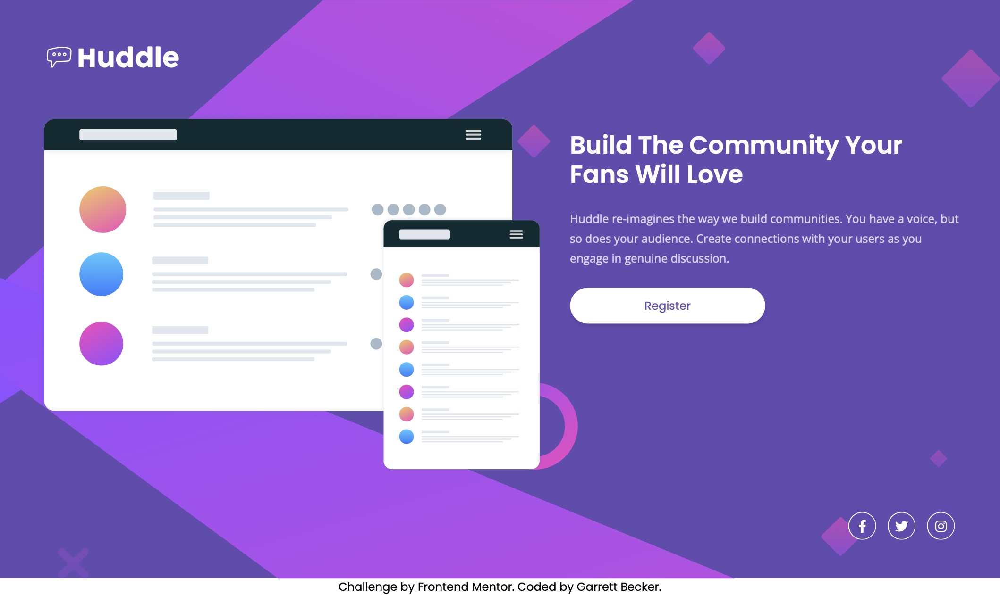

# Frontend Mentor - Stats Preview Card Component Solution

This is my solution to the [Huddle landing page with single introductory section challenge on Frontend Mentor](https://www.frontendmentor.io/challenges/huddle-landing-page-with-a-single-introductory-section-B_2Wvxgi0). I'm super thankful to have found Frontend Mentor as a great way to confidently grow in my coding skills with real-life projects. 

## Table of contents

- [Overview](#overview)
  - [Project Brief](#project-brief)
  - [Mobile View](#mobile-view)
  - [Desktop View](#desktop-view)
  - [Links](#links)
- [My process](#my-process)
  - [Built with](#built-with)
  - [What I learned](#what-i-learned)
  - [Continued development](#continued-development)
  - [Useful resources](#useful-resources)
- [Author](#author)
- [Acknowledgments](#acknowledgments)

## Overview

### [Project Brief](./project%20brief/)

Your challenge is to build out this landing page from the designs provided in the starter code.

You can use any tools you like to help you complete the challenge. So if you've got something you'd like to practice, feel free to give it a go.

Your users should be able to: 

- View the optimal layout for the page depending on their device's screen size
- See hover states for all interactive elements on the page

Want some support on the challenge? [Join our Slack community](https://www.frontendmentor.io/slack) and ask questions in the **#help** channel.

### Mobile View


### Desktop View



### Links

- [Solution URL](https://www.frontendmentor.io/solutions/huddle-landing-with-next-tailwind-qui6I1xtZh)
- [Live Site URL](https://huddle-landing-gdbecker.netlify.app)

## My process

### Built with

- [React](https://reactjs.org/) - JS library
- [Next.js](https://nextjs.org) - React framework
- HTML5
- CSS
- [Tailwind CSS](https://tailwindcss.com) - CSS framework
- Mobile-first workflow
- [VS Code](https://code.visualstudio.com)

### What I learned

This small landing page was great practice for using Tailwind in tandem with Next.js - I am greatly enjoying using this framework to write CSS within my HTMl. The challenge is to keep the utility classes as concise as possible because it's easy to add too many and add clutter to the code; as I keep working on these projects I'm aiming for functionality and readability. The trickiest part was handling the separately sized background images, and I decided on using a single background CSS class which changes the image source depending on screen size.

Here are a few code samples from this project:

```html
<!-- Main tag showing background settings and intro image -->
<main className="p-12 w-full h-full bg-violet bg-illustration bg-cover bg-top bg-no-repeat font-poppinsRegular text-white-100 text-center">
  <div className="flex">
    <Image src={Logo} alt="logo" width={175} height={125} />
  </div>
  ...
</main>
```

```css
/* CSS for switching between the two background images depending on screen size */
.bg-illustration {
  background-image: url(../../public/bg-mobile.svg);
}

@media (min-width: 768px) {
  .bg-illustration {
    background-image: url(../../public/bg-desktop.svg);
  }
}
```

### Continued development

As a starter developer, I want to keep growing in working as a team and learning how to deliver smaller packages of code at a time, such as components like this one. I thought this project was a good way to get back into React and begin doing just that!

### Useful resources

- [CSS Formatter](http://www.lonniebest.com/FormatCSS/) - I found this helpful site when I'm feeling lazy and don't want to format my CSS code, I can have this do it for me, especially putting everything in alphabetical order.
- [Tailwind Responsive Classes](https://tailwindcss.com/docs/responsive-design) - Tailwind makes it easy to add specific CSS code for screen size break points.

## Author

- Website - [Garrett Becker]()
- Frontend Mentor - [@gdbecker](https://www.frontendmentor.io/profile/gdbecker)
- LinkedIn - [Garrett Becker](https://www.linkedin.com/in/garrett-becker-923b4a106/)

## Acknowledgments

Thank you to the Frontend Mentor team for providing all of these fantastic projects to build, and for our getting to help each other grow!