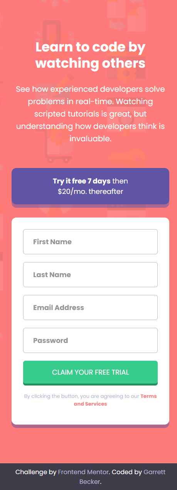
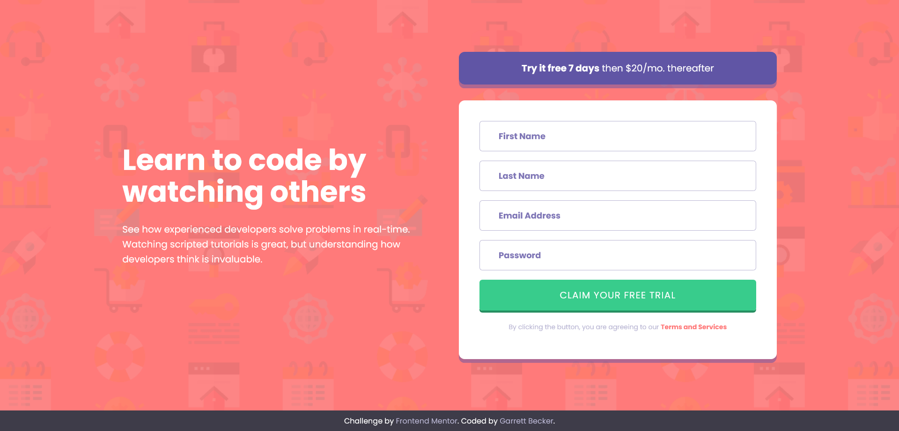

# Frontend Mentor - Intro Component with Sign-Up Form Solution

This is my solution to the [Intro component with sign-up form challenge on Frontend Mentor](https://www.frontendmentor.io/challenges/intro-component-with-signup-form-5cf91bd49edda32581d28fd1). I'm super thankful to have found Frontend Mentor as a great way to confidently grow in my coding skills with real-life projects. 

## Table of contents

- [Frontend Mentor - Intro Component with Sign-Up Form Solution](#frontend-mentor---intro-component-with-sign-up-form-solution)
	- [Table of contents](#table-of-contents)
	- [Overview](#overview)
		- [Project Brief](#project-brief)
		- [Mobile View](#mobile-view)
		- [Desktop View](#desktop-view)
		- [Links](#links)
	- [My process](#my-process)
		- [Built with](#built-with)
		- [What I learned](#what-i-learned)
		- [Continued development](#continued-development)
		- [Useful resources](#useful-resources)
	- [Author](#author)
	- [Acknowledgments](#acknowledgments)

## Overview

### [Project Brief](./project%20brief/)

Your challenge is to build out this introductory component and get it looking as close to the design as possible.

You can use any tools you like to help you complete the challenge. So if you've got something you'd like to practice, feel free to give it a go.

Your users should be able to:

- View the optimal layout for the site depending on their device's screen size
- See hover states for all interactive elements on the page
- Receive an error message when the `form` is submitted if:
  - Any `input` field is empty. The message for this error should say *"[Field Name] cannot be empty"*
  - The email address is not formatted correctly (i.e. a correct email address should have this structure: `name@host.tld`). The message for this error should say *"Looks like this is not an email"*

Want some support on the challenge? [Join our community](https://www.frontendmentor.io/community) and ask questions in the **#help** channel.

### Mobile View



### Desktop View



### Links

- [Solution URL](https://www.frontendmentor.io/solutions/intro-component-with-html-css-javascript-H3bRV-s9mg)
- [Live Site URL](https://intro-component-sign-up-gdbecker.netlify.app/)

## My process

### Built with

- HTML5
- CSS3
- JavaScript
- Mobile-first workflow
- [VS Code](https://code.visualstudio.com)

### What I learned

This was more good practice building my own forms without a framework like Angular or React, and adding custom error messages and icons. As usual I worked on getting the structure and styling down first to match the design as close as possible, and then moved into the form functionality. It wasn't bad - each field needed to be checked for being empty, and the email field had an extra test for being a valid format. The form only shows the error message and icon when there's an issue with that specific field. On successful completion the form clears out. Smaller size screen breaks were added for custom sizing on mobile devices. Happy with how this turned out! I definitely want to keep building more projects with the basic HTML, CSS, and JavaScript tools like in this one.

Here are a few code samples from this project:

```html
<!-- First name form field -->
<div class="input-row">
	<input class="" id="first-name" type="text" placeholder="First Name">
	
</div>
<p class="error-message hidden" id="error-first-name">First name cannot be empty</p>
```

```css
/* Error message and icon styling */
.error-icon {
	position: absolute;
	width: 25px;
	height: 25px;
	top: 13px;
	right: 30px;
	z-index: 3;
}

.error-message {
	margin: 0;
	margin-top: -0.7rem;
	margin-bottom: 1rem;
	text-align: right !important;
	font-style: italic;
	color: var(--red) !important;
}
```

```javascript
// First name form field validation
if (firstName.value === '' || firstName.value === undefined) {
	firstName.classList.add('error');
	firstNameError.classList.remove('hidden');
	firstNameErrorIcon.classList.remove('hidden');
} else {
	firstName.classList.remove('error');
	firstNameError.classList.add('hidden');
	firstNameErrorIcon.classList.add('hidden');
}
```

### Continued development

As a starter developer, I want to keep growing in working as a team and learning how to deliver smaller packages of code at a time, such as components like this one. I thought this project was a good way to get back into vanilla HTML, CSS, and JavaScript and begin doing just that!

### Useful resources

- [CSS Formatter](http://www.lonniebest.com/FormatCSS/) - I found this helpful site when I'm feeling lazy and don't want to format my CSS code, I can have this do it for me, especially putting everything in alphabetical order.
- Brad Traversy's [50 Projects In 50 Days - HTML, CSS & JavaScript course on Udemy](https://www.udemy.com/course/50-projects-50-days/) - I highly recommend this course for great practice in using just HTML, CSS, and vanilla JavaScript to build amazing projects.

## Author

- Website - [Garrett Becker]()
- Frontend Mentor - [@gdbecker](https://www.frontendmentor.io/profile/gdbecker)
- LinkedIn - [Garrett Becker](https://www.linkedin.com/in/garrett-becker-923b4a106/)

## Acknowledgments

Thank you to the Frontend Mentor team for providing all of these fantastic projects to build, and for our getting to help each other grow!