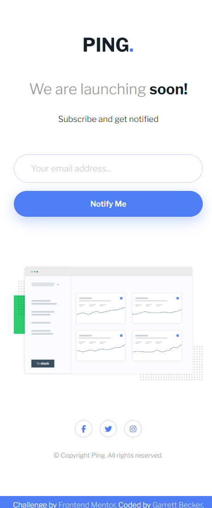
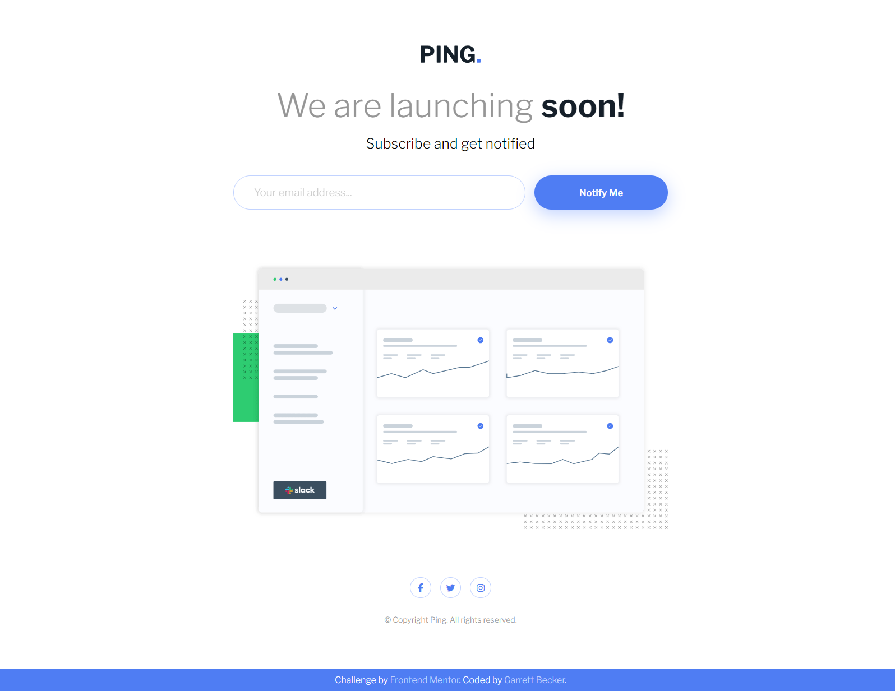

# Frontend Mentor - Ping Single Column Coming Soon Page Solution

This is my solution to the [Ping single column coming soon page challenge on Frontend Mentor](https://www.frontendmentor.io/challenges/ping-single-column-coming-soon-page-5cadd051fec04111f7b848da). I'm super thankful to have found Frontend Mentor as a great way to confidently grow in my coding skills with real-life projects. 

## Table of contents

- [Frontend Mentor - Ping Single Column Coming Soon Page Solution](#frontend-mentor---ping-single-column-coming-soon-page-solution)
	- [Table of contents](#table-of-contents)
	- [Overview](#overview)
		- [Project Brief](#project-brief)
		- [Mobile View](#mobile-view)
		- [Desktop View](#desktop-view)
		- [Links](#links)
	- [My process](#my-process)
		- [Built with](#built-with)
		- [What I learned](#what-i-learned)
		- [Continued development](#continued-development)
		- [Useful resources](#useful-resources)
	- [Author](#author)
	- [Acknowledgments](#acknowledgments)

## Overview

### [Project Brief](./project%20brief/)

Your challenge is to build out this Coming Soon page and get it looking as close to the design as possible.

You can use any tools you like to help you complete the challenge. So if you've got something you'd like to practice, feel free to give it a go.

Your users should be able to: 

- View the optimal layout for the site depending on their device's screen size
- See hover states for all interactive elements on the page
- Submit their email address using an `input` field
- Receive an error message when the `form` is submitted if:
	- The `input` field is empty. The message for this error should say *"Whoops! It looks like you forgot to add your email"*
	- The email address is not formatted correctly (i.e. a correct email address should have this structure: `name@host.tld`). The message for this error should say *"Please provide a valid email address"*

Want some support on the challenge? [Join our community](https://www.frontendmentor.io/community) and ask questions in the **#help** channel.

### Mobile View



### Desktop View



### Links

- [Solution URL]()
- [Live Site URL](https://ping-coming-soon-page-gdbecker.netlify.app/)

## My process

### Built with

- HTML5
- CSS3
- JavaScript
- Mobile-first workflow
- [VS Code](https://code.visualstudio.com)

### What I learned

I liked that this challenge gave practice for making my own form inputs and validation, because I'd been pretty used to using frameworks to make them work, like from Bootstrap or Angular. As usual with these HTML/CSS only sites I worked on getting the structure and styling down first to match the design as close as possible, and then moved into the 'notify' form functionality. The button has an event listener for a click, and checks to see if the input field is valid, checking for empty/undefined values and if the email matches the valid regex. If any of those are true, then the red error message pops up (taking off a custom 'hidden' class) and the input box is outlined in red. I also went ahead and added my own blue success message if everything works so users can know that Ping will reach back out with updates later. Happy with how this turned out! I definitely want to keep building more projects with the basic HTML, CSS, and JavaScript tools like in this one.

Here are a few code samples from this project:

```html
<!-- Form section structure -->
<div class="form-row">
	<input 
		type="text"
		placeholder="Your email address..."
	>
	<button>Notify Me</button>
</div>
<p id="error-message" class="message hidden">Please provide a valid email address</p>
<p id="success-message" class="message hidden">Submitted! Keep on the lookout for an email from us soon!</p>
```

```css
/* Button and status messages styling */
.form-row button {
	font-family: inherit;
	font-weight: 600;
	background-color: var(--blue);
	color: var(--white);
	border: none;
	border-radius: 30px;
	width: 220px;
	padding: 0.9rem 1.8rem 0.9rem 1.8rem;
	box-shadow: var(--paleblue) 0px 7px 24px;
	cursor: pointer;
}

.form-row button:hover {
	background-color: var(--paleblue);
}

.message {
	display: flex;
	width: 100%;
	font-style: italic;
	font-size: 0.7rem;
	margin-top: -2.5rem;
	margin-bottom: 2.5rem;
	padding-left: 1.8rem;
	text-align: start;
}

#error-message {
	color:var(--red);
}

#success-message {
	color: var(--blue);
}
```

```javascript
// Form button event listener
btn.addEventListener('click', () => {
	const valid = validateEmail(input.value);
	
	if (input.value === '' || input.value === undefined || !validateEmail(input.value)) {
		input.classList.add('error');
		error.classList.remove('hidden');
		success.classList.add('hidden');
	} else {
		input.classList.remove('error');
		input.classList.add('success');
		error.classList.add('hidden');
		success.classList.remove('hidden');

		input.value = '';
	}
});
```

### Continued development

As a starter developer, I want to keep growing in working as a team and learning how to deliver smaller packages of code at a time, such as components like this one. I thought this project was a good way to get back into React and begin doing just that!

### Useful resources

- [CSS Formatter](http://www.lonniebest.com/FormatCSS/) - I found this helpful site when I'm feeling lazy and don't want to format my CSS code, I can have this do it for me, especially putting everything in alphabetical order.
- Brad Traversy's [50 Projects In 50 Days - HTML, CSS & JavaScript course on Udemy](https://www.udemy.com/course/50-projects-50-days/) - I highly recommend this course for great practice in using just HTML, CSS, and vanilla JavaScript to build amazing projects.

## Author

- Website - [Garrett Becker]()
- Frontend Mentor - [@gdbecker](https://www.frontendmentor.io/profile/gdbecker)
- LinkedIn - [Garrett Becker](https://www.linkedin.com/in/garrett-becker-923b4a106/)

## Acknowledgments

Thank you to the Frontend Mentor team for providing all of these fantastic projects to build, and for our getting to help each other grow!