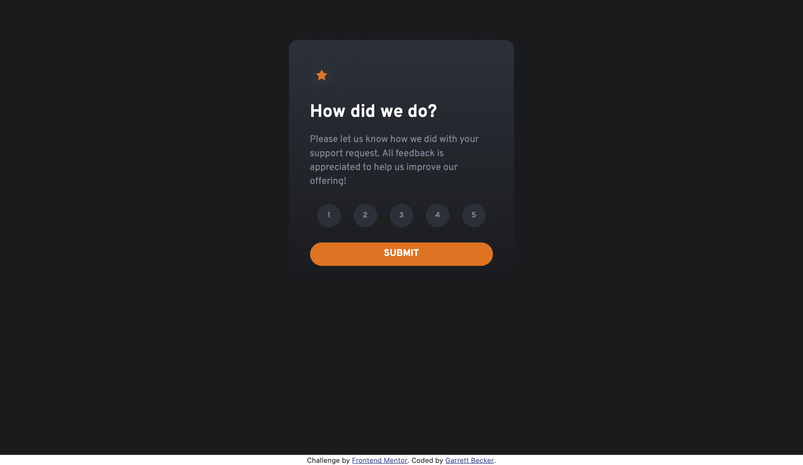
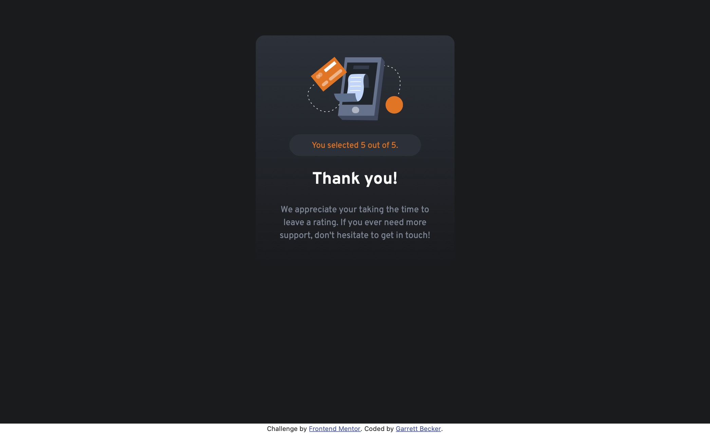

# Frontend Mentor - Interactive Rating Component Solution

This is my solution to the [Interactive rating component challenge on Frontend Mentor](https://www.frontendmentor.io/challenges/interactive-rating-component-koxpeBUmI). I'm super thankful to have found Frontend Mentor as a great way to confidently grow in my coding skills with real-life projects. 

## Table of contents

- [Overview](#overview)
  - [Project Brief](#project-brief)
  - [Mobile View](#mobile-view)
  - [Desktop View](#desktop-view)
  - [Desktop Submitted View](#desktop-submitted-view)
  - [Links](#links)
- [My process](#my-process)
  - [Built with](#built-with)
  - [What I learned](#what-i-learned)
  - [Continued development](#continued-development)
  - [Useful resources](#useful-resources)
- [Author](#author)
- [Acknowledgments](#acknowledgments)

## Overview

### [Project Brief](./project%20brief/)

Your challenge is to build out this interactive rating component and get it looking as close to the design as possible.

You can use any tools you like to help you complete the challenge. So if you've got something you'd like to practice, feel free to give it a go.

Your users should be able to:

- View the optimal layout for the app depending on their device's screen size
- See hover states for all interactive elements on the page
- Select and submit a number rating
- See the "Thank you" card state after submitting a rating

Want some support on the challenge? [Join our Slack community](https://www.frontendmentor.io/slack) and ask questions in the **#help** channel.

### Mobile View


### Desktop View



### Desktop Submitted View



### Links

- [Solution URL]()
- [Live Site URL](https://rating-component-gdbecker.netlify.app)

## My process

### Built with

- [React](https://reactjs.org/) - JS library
- HTML5
- CSS
- Bootstrap
- Mobile-first workflow
- [VS Code](https://code.visualstudio.com)

### What I learned

This was a great challenge not just to keep practicing creating components from design specs and guidelines, but also using a bit of React JS to make the functionality work. I liked getting to practice hooks and managing state in this one, and handling the submit button click to pop up the result view. I first developed each view one at a time and make sure the design matched up closely, and then devided them up between two Fragment tags, so ultimately a React state would decide which one was rendered, depending on if the form was submitted or not. This was also great practice for lining up multiple buttons in a row, as well as managing spacing and hover states.

Here are a few code samples from this project:

```html
<Fragment>
  <div className="container mt-3">
    <div className="row">
      <div className="thank-you">
        <ThankYou className="thank-you"></ThankYou>
      </div>
    </div>

    <div className="row mt-4">
      <div className="col-1"></div>
      <div className="col-10">
        <div className="rating-result-box">
          <p className="rating-result">You selected {selected} out of 5.</p>
        </div>
      </div>
      <div className="col-1"></div>
    </div>

    <div className="row mt-4">
      <h3 className="rating-header-result">Thank you!</h3>
    </div>

    <div className="row mt-3">
      <p className="rating-text-result">
        We appreciate your taking the time to leave a rating.
        If you ever need more support, don't hesitate to get in touch!
      </p>
    </div>
  </div>
  </Fragment>
```

```css
.rating-result-box {
  background-color: #252D37;
  border-radius: 40px;
  height: 37px;
  padding-top: 4%;
  text-align: center;
}

.rating-result {
  color: #FB7413;
  font-family: Overpass-Regular;
  font-size: 14px;
  margin: auto;
}
```

```js
const [submitted, setSubmitted] = useState('');
const [selected, setSelected] = useState('');

const onClick = (e) => {
  setSelected(e.target.value);
  console.log(e.target.value);
}

const onSubmit = async (e) => {
  e.preventDefault();
  setSubmitted(true);
}
```

### Continued development

As a starter developer, I want to keep growing in working as a team and learning how to deliver smaller packages of code at a time, such as components like this one. I thought this project was a good way to get back into React and begin doing just that!

### Useful resources

- [CSS Formatter](http://www.lonniebest.com/FormatCSS/) - I found this helpful site when I'm feeling lazy and don't want to format my CSS code, I can have this do it for me, especially putting everything in alphabetical order.
- [CSS Button Generator](https://css3buttongenerator.com) - Quickly make buttons by inputting desired features. This helps as I'm continuing to learn how to make good looking buttons.

## Author

- Website - [Garrett Becker]()
- Frontend Mentor - [@gdbecker](https://www.frontendmentor.io/profile/gdbecker)
- LinkedIn - [Garrett Becker](https://www.linkedin.com/in/garrett-becker-923b4a106/)

## Acknowledgments

Thank you to the Frontend Mentor team for providing all of these fantastic projects to build, and for our getting to help each other grow!