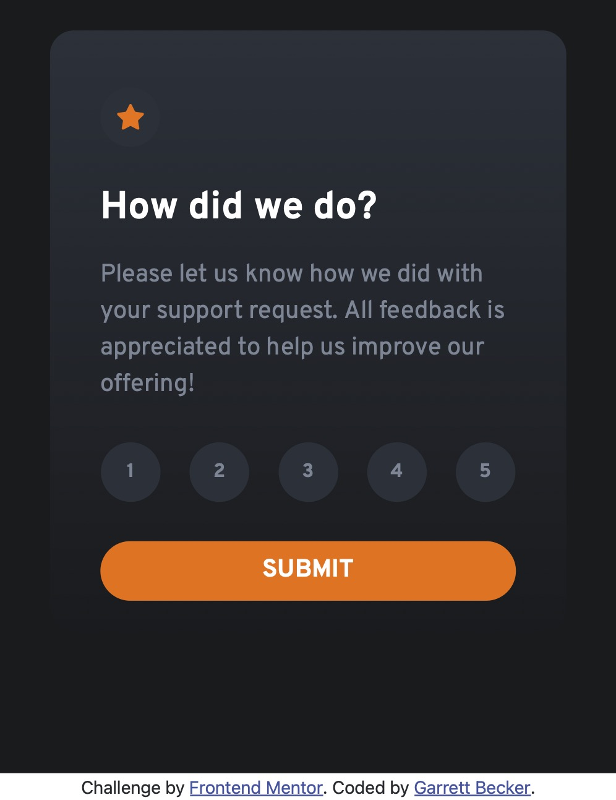

# Frontend Mentor - Interactive Rating Component Solution

This is my solution to the [Interactive rating component challenge on Frontend Mentor](https://www.frontendmentor.io/challenges/interactive-rating-component-koxpeBUmI). I'm super thankful to have found Frontend Mentor as a great way to confidently grow in my coding skills with real-life projects. 

## Table of contents

- [Overview](#overview)
  - [Project Brief](#project-brief)
  - [Mobile View](#mobile-view)
  - [Desktop View](#desktop-view)
  - [Links](#links)
- [My process](#my-process)
  - [Built with](#built-with)
  - [What I learned](#what-i-learned)
  - [Continued development](#continued-development)
  - [Useful resources](#useful-resources)
- [Author](#author)
- [Acknowledgments](#acknowledgments)

## Overview

### [Project Brief](./project%20brief/)

Your challenge is to build out this interactive rating component and get it looking as close to the design as possible.

You can use any tools you like to help you complete the challenge. So if you've got something you'd like to practice, feel free to give it a go.

Your users should be able to:

- View the optimal layout for the app depending on their device's screen size
- See hover states for all interactive elements on the page
- Select and submit a number rating
- See the "Thank you" card state after submitting a rating

Want some support on the challenge? [Join our Slack community](https://www.frontendmentor.io/slack) and ask questions in the **#help** channel.

### Mobile View



### Desktop View


### Links

- [Solution URL]()
- [Live Site URL](https://rating-component-gdbecker.netlify.app)

## My process

### Built with

- [React](https://reactjs.org/) - JS library
- HTML5
- CSS
- Bootstrap
- Mobile-first workflow
- [VS Code](https://code.visualstudio.com)

### What I learned

After working through several challenges with React and Bootstrap, I wanted to challenge myself and learn a couple of new tools I've heard about - Next.js and SASS. Definitely a learning curve for both of these but completely worth it, especially coming to grips with SASS - it was so handy separating my color palette and font variables into a separate file and then calling them throughout the .scss file. Next.js was also a lot of fun to learn and get started with, as well as figuring out how the server side rendering works and when to 'use client' s needed - I needed to for the home page on this project to pull in the Bootstrap js I installed. It felt like a good step to start with a smaller component project like this one to learn new tools.

Here are a few code samples from this project:

```html

```

```css

```

```js

```

### Continued development

As a starter developer, I want to keep growing in working as a team and learning how to deliver smaller packages of code at a time, such as components like this one. I thought this project was a good way to get back into React and begin doing just that!

### Useful resources

- [CSS Formatter](http://www.lonniebest.com/FormatCSS/) - I found this helpful site when I'm feeling lazy and don't want to format my CSS code, I can have this do it for me, especially putting everything in alphabetical order.
- [CSS Button Generator](https://css3buttongenerator.com) - Quickly make buttons by inputting desired features

## Author

- Website - [Garrett Becker]()
- Frontend Mentor - [@gdbecker](https://www.frontendmentor.io/profile/gdbecker)
- LinkedIn - [Garrett Becker](https://www.linkedin.com/in/garrett-becker-923b4a106/)

## Acknowledgments

Thank you to the Frontend Mentor team for providing all of these fantastic projects to build, and for our getting to help each other grow!