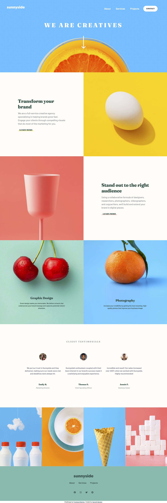

# Frontend Mentor - Sunnyside Agency Landing Page Solution

This is my solution to the [Sunnyside agency landing page challenge on Frontend Mentor](https://www.frontendmentor.io/challenges/sunnyside-agency-landing-page-7yVs3B6ef). I'm super thankful to have found Frontend Mentor as a great way to confidently grow in my coding skills with real-life projects. 

## Table of contents

- [Overview](#overview)
  - [Project Brief](#project-brief)
  - [Mobile View](#mobile-view)
  - [Mobile View with Menu](#mobile-view-with-menu)
  - [Desktop View](#desktop-view)
  - [Links](#links)
- [My process](#my-process)
  - [Built with](#built-with)
  - [What I learned](#what-i-learned)
  - [Continued development](#continued-development)
  - [Useful resources](#useful-resources)
- [Author](#author)
- [Acknowledgments](#acknowledgments)

## Overview

### [Project Brief](./project%20brief/)

Your challenge is to build out this landing page and get it looking as close to the design as possible.

This challenge focuses mostly on HTML & CSS. There's a tiny bit of JS included for the mobile navigation toggle. But you could also choose to do this without JS!

You can use any tools you like to help you complete the challenge. So if you've got something you'd like to practice, feel free to give it a go.

Your users should be able to:

- View the optimal layout for the site depending on their device's screen size
- See hover states for all interactive elements on the page

Want some support on the challenge? [Join our Slack community](https://www.frontendmentor.io/slack) and ask questions in the **#help** channel.

### Mobile View


### Mobile View with Menu


### Desktop View



### Links

- [Solution URL](https://www.frontendmentor.io/solutions/sunnyside-landing-page-with-next-sass-EZ3xT9DAIG)
- [Live Site URL](https://sunnyside-gdbecker.netlify.app)

## My process

### Built with

- [React](https://reactjs.org/) - JS library
- [Next.js](https://nextjs.org) - React framework
- HTML5
- CSS
- [SASS](https://sass-lang.com) - CSS extension language
- Bootstrap
- Mobile-first workflow
- [VS Code](https://code.visualstudio.com)

### What I learned

As my second landing page with Next.js and SASS, I'm getting a lot more comfortable with using both of these frameworks for building - and Sunnyside's page was deceptively challenging. It looks simple at first, but that's what I really enjoy about working on these challenges: they push you to not simply copy/paste similar code you've written before but problem solve and think through what the needs are for the look and function. On each landing page I've started first with the top navbar, and then go section by section to match up with the design specs. I went for Bootstrap 'container-fluid' classes to get the full page image rows, and tried to keep my HTML as concise as possible. There was quite a bit of CSS tinkering I needed to do as I was figuring out the best way to design for different screen sizes. I feel especially proud for figuring out the mobile drop-down menu with the triangle on the top right - really happy with how this one turned out after persevering through the design challenges!

Here are a few code samples from this project:

```html
<!-- Drop-down part of the navbar menu with triangle anchor -->
<div className="collapse navbar-collapse" id="navbarNav">
  <div className="triangle"></div>
  <ul className="navbar-nav ms-auto">
    <li className="nav-item">
        <a className="nav-link" href="/">About</a>
    </li>
    <li className="nav-item">
      <a className="nav-link" href="/">Services</a>
    </li>
    <li className="nav-item">
      <a className="nav-link" href="/">Projects</a>
    </li>
    <li className="nav-item">
      <button className="contact-button" type="button">CONTACT</button>
    </li>
  </ul>
</div>
```

```css
/* CSS for the drop-down navbar mobile menu */
@media(max-width: 986px) { 
  .navbar-collapse {
    background-color:#FFFDFA;
    padding-bottom: 20px;
    padding-top: 20px;
  }

  .nav-item {
    padding: 7px 0px 7px 0px;
  }

  .nav-link {
    color: $grayishBlue !important;
  }

  .nav-link:hover {
    color: $softRed !important;
  }

  .contact-button {
    background-color: $yellow;
  }

  .contact-button:hover {
    background-color: $softRed;
  }

  .triangle {
    background: linear-gradient(to bottom right, transparent 0%, transparent 50%, $white 50%, $white 100%);
    height: 42px;
    position: absolute;
    right: 0px;
    top: -30px;
    width: 42px;
  }
}
```

```js
// Waiting to mount while loading in Bootstrap JS
const [loading, setLoading] = useState(true);

useEffect(() => {
  import ('bootstrap/dist/js/bootstrap.min.js');
  setLoading(false);
}, []);

if (loading) {
  return <LoadingPage />
}
```

### Continued development

As a starter developer, I want to keep growing in working as a team and learning how to deliver robust and beautiful solutions like this one. I thought this project was a good way to get back into React and begin doing just that!

### Useful resources

- [CSS Formatter](http://www.lonniebest.com/FormatCSS/) - I found this helpful site when I'm feeling lazy and don't want to format my CSS code, I can have this do it for me, especially putting everything in alphabetical order.
- [Accessing LocalHost on iPhone](https://stackoverflow.com/questions/3132105/how-do-you-access-a-website-running-on-localhost-from-iphone-browser) - Game changer for developing on mobile and desktop simultaneously! This was very helpful for being able to see my work on my phone before pushing it to production on Netlify or GitHub pages.
- [Bootstrap Containers](https://getbootstrap.com/docs/5.0/layout/containers/) - Handy guide for Bootstrap's docs on container classes. Making Sunnyside's landing page was great practice for using 'container-fluid'

## Author

- Website - [Garrett Becker]()
- Frontend Mentor - [@gdbecker](https://www.frontendmentor.io/profile/gdbecker)
- LinkedIn - [Garrett Becker](https://www.linkedin.com/in/garrett-becker-923b4a106/)

## Acknowledgments

Thank you to the Frontend Mentor team for providing all of these fantastic projects to build, and for our getting to help each other grow!